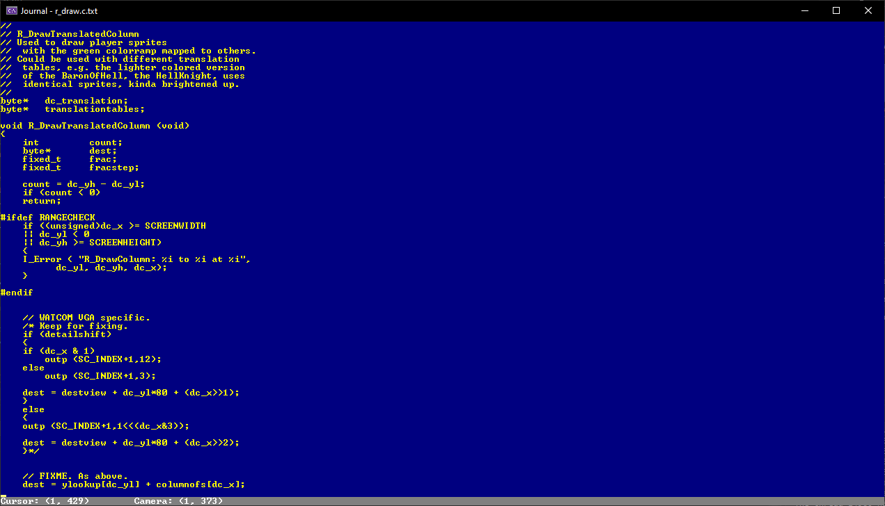

# Journal
## Features
- Undo and redo action buffers
- Clipboard (copying and pasting)
- Saves list of files accessed by user sorted by most recently accessed
- AES encryption and DMC (Dynamic Markov Compression)
- Console theming

All runs completely in the Windows terminal

## Images

---
DISCLAIMER: This application is for educational purposes and should not be used as a cryptographically secure application.
